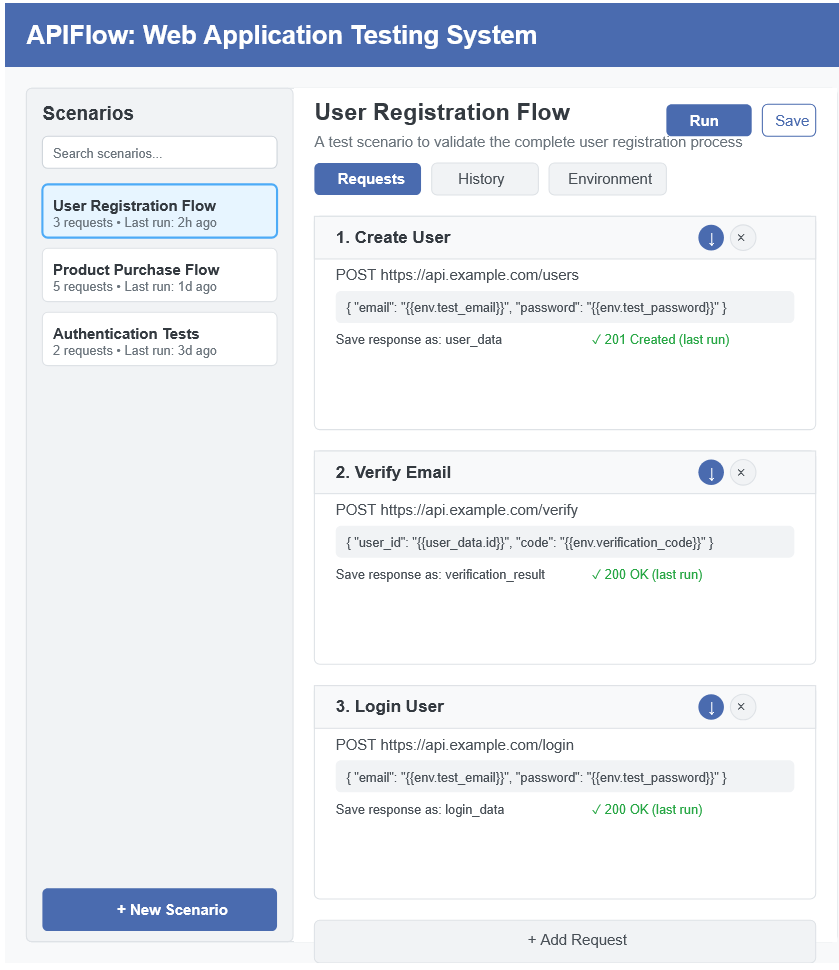
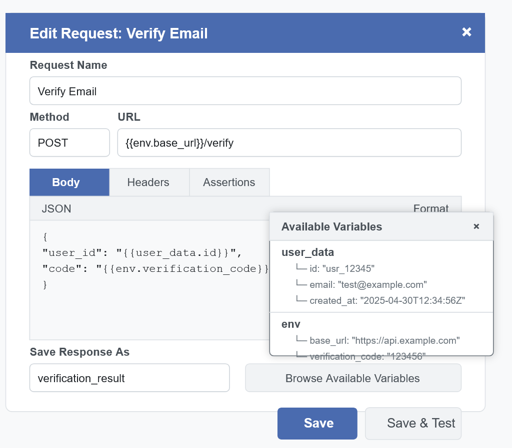

# 🛠️ DGate API Testing Automation

> **Python script** to automatically test your Java-based DGate system through dynamic chained API requests with full dependency management.

---

## 📌 Table of Contents
- [About the Project](#about-the-project)
- [Project Structure](#project-structure)
- [Features](#features)
- [How It Works](#how-it-works)
- [Example Scenario](#example-scenario)
- [Setup Instructions](#setup-instructions)
- [Future Enhancements](#future-enhancements)
- [Screenshots](#screenshots)
- [License](#license)

---

## 📖 About the Project

This tool automatically **chains API requests** based on **dependencies** between responses and requests.  
Instead of manually calling previous APIs, the script **auto-handles everything**, making testing easy and fast.

Built specifically to support the **DGate Java system** but designed to be **generic** for any API structure.

---

## 📂 Project Structure

```plaintext
Script/
│
├── main.py                   # Entry point for running scenarios
│
├── flow/
│   ├── flow_manager.py        # Flow engine
│   └── flows/                 # Predefined flows (scenarios)
│
├── utils/
│   ├── mapping.py             # Model dependency handling
│   ├── dependency_resolver.py # Auto-resolve call order
│   ├── config_loader.py       # Token generation, secrets
│
├── config/                    # Dynamic token configuration
│
├── model/                     # API models (Product, Plan, etc.)
│
├── scenarios/                 # Saved test flows (.yaml/.json)
│
└── README.md
```

---

## ✨ Features

- 🔄 **Auto-handle API dependencies** (no manual ordering needed).
- 🔑 **Auto-generate authentication tokens** if required (client credentials, secrets).
- 🔗 **Chain any number of APIs dynamically**.
- 🛡️ **Assertions** for validating status codes and JSON body fields.
- 📄 **Save scenarios** in easy-to-edit **YAML** or **JSON** files.
- 🧩 **Support GET and POST** methods natively.
- 🚀 **Start at any point (n+1)** — previous steps auto-executed internally.

---

## ⚙️ How It Works

- Read a **scenario file** (YAML or JSON).
- Parse environment variables.
- Resolve **dependency tree** automatically.
- Execute requests in correct order.
- **Save response parts** to use in the next request body or URL.
- Perform **assertions** on responses.

---

## 🧪 Example Scenario

```yaml
name: "User Registration Flow"
id: reg_flow_123
description: "Testing the user registration process."
version: 1.0
created_at: "2025-04-30T10:15:30Z"
updated_at: "2025-04-30T11:32:14Z"
environment:
  test_email: "test@example.com"
  test_password: "securePassword123"
  verification_code: "123456"
  base_url: "https://api.example.com"
requests:
  - name: "Create User"
    method: POST
    url: "{{env.base_url}}/users"
    body: |
      {
        "email": "{{env.test_email}}",
        "password": "{{env.test_password}}"
      }
    save_as: "user_data"
    assertions:
      - type: "status_code"
        value: 201

  - name: "Verify Email"
    method: POST
    url: "{{env.base_url}}/verify"
    body: |
      {
        "user_id": "{{user_data.id}}",
        "code": "{{env.verification_code}}"
      }
    save_as: "verification_result"
    assertions:
      - type: "status_code"
        value: 200

  - name: "Login User"
    method: POST
    url: "{{env.base_url}}/login"
    body: |
      {
        "email": "{{env.test_email}}",
        "password": "{{env.test_password}}"
      }
    save_as: "login_data"
    assertions:
      - type: "status_code"
        value: 200
```

---

## 🚀 Setup Instructions

1. **Clone the repo:**

```bash
git clone https://your-repo-link.git
cd Script/
```

2. **Install required libraries:**

```bash
pip install -r requirements.txt
```

3. **Run a flow:**

```bash
python main.py --flow scenarios/example_flow.yaml
```

---

## 🔥 Future Enhancements

- Web UI for one-click scenario execution.
- Parallel API execution for faster testing.
- Detailed HTML reporting of test results.
- CI/CD Pipeline integration.

---

## 📸 Screenshots

| API Request Editor | Full Scenario View |
| :---: | :---: |
|  |  |

---

# ✅ Professional - Clean - Ready!

---
